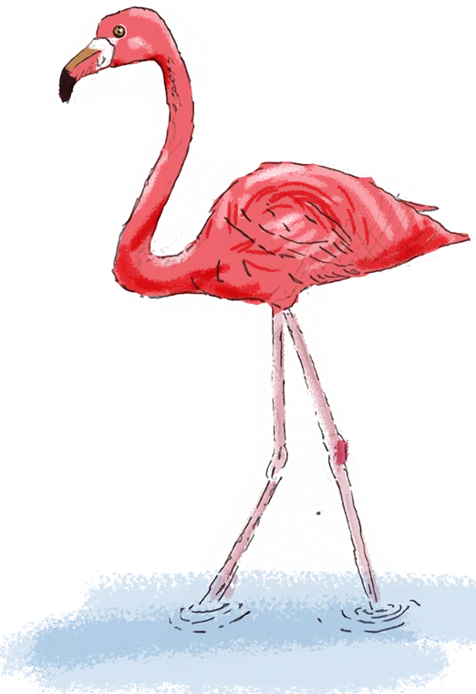

# Folio design system

v1.0 · 2026 · for the website and the printed book together.

The one-sheet map of this document is [docs/design-guide.png](docs/design-guide.png)
(`deno task guide` redraws it). The sheet is for remembering; this file is for the
detail. The state of the site before the system was written down is recorded in
[docs/design-audit.md](docs/design-audit.md).

## 00. Principle

> **One shell. Six semesters. A few voices.**
> The drawings carry the colour. Everything around them stays quiet.

- **Colour** marks where you are: one neutral ground, one accent, one colour per semester.
- **Type** gives the hierarchy.
- **Grid** gives the consistency.
- **Birds** give the memory: one per semester.

The **shell** (navbar, grid, page shape, devices, footer) never changes. Each
**semester** has one colour and one bird. A project page may speak in the **voice** of
its own boards, inside the shell.

If something isn't covered here, choose the quieter option.

## 01. Colour

**90% quiet, 10% colour.** Never introduce another colour to solve a local problem.

### Neutrals and accent

| Group | Token | Value | Use |
|---|---|---|---|
| Surface | `--paper` | `#f6f4ef` | Page ground |
| | `--paper-2` | `#eeebe4` | Tinted bands and chapters |
| | `--card` | `#fffdf9` | Cards and tiles |
| Text | `--ink` | `#161514` | Headings, dark bands |
| | `--ink-2` | `#34322f` | Body text |
| | `--muted` | `#6b6760` | Captions, labels |
| Structure | `--line` | `#dfdad0` | Rules and borders |
| | `--line-strong` | `#cbc4b6` | Stronger rules |
| Accent | `--accent` | `#a8483f` | Terracotta as text on paper |
| | `--accent-fill` | `#b85450` | Terracotta as a fill, and the focus ring |
| | `--accent-light` | `#e39a86` | Terracotta on dark |

Components never use these directly. They use the **roles** (`--text`, `--text-2`,
`--text-muted`, `--rule`, `--rule-strong`, `--accent-text`, `--surface`), which a dark
band redefines. That is how the Personal band, the footer and the CV card turn dark
without a single override.

### Semester colours

Each is taken from that semester's own work. The same six are used in the book.

| | Name | Fill `--sem-N` | Text `--sem-N-text` | Print (CMYK) | From |
|---|---|---|---|---|---|
| I | Ink | `#3e4c8a` | `#3e4c8a` | 80 65 10 5 | Ink in water |
| II | Ember | `#d9772b` | `#a6591e` | 10 60 90 0 | The flame painting |
| III | Mauve | `#b06a8e` | `#a1557c` | 30 70 20 5 | Henveiru's pink wash |
| IV | Olive | `#7a8b3c` | `#667432` | 55 30 95 10 | The mangrove island |
| V | Lagoon | `#2f8c8c` | `#297979` | 80 25 45 5 | The floating lagoon |
| VI | Red | `#a63d40` | `#a63d40` | 25 85 70 15 | Reserved for the final semester |

Engineering uses `--eng-blue` (`#1f5fa8`) in the same way.

### Rules

- Inside a semester context (`data-sem="N"` or the page's body class) use `--sem` for
  fills, edges and dots, and `--sem-text` for anything that is read. The fills of II to V
  are too light to be text on paper.
- One accent per view. On a project page the accent is the semester colour, not terracotta.
- Colour marks position (which semester) or state (current, hover). It is never decoration.
- Text on paper reaches 4.5:1. Check any new pair before using it.
- No colour values in page stylesheets. A voice's palette is declared in the Voices
  block of `main.css` (section 08).

## 02. Type

### Families

Six families. No page loads any other.

| Token | Family | Role |
|---|---|---|
| `--font-sans` | Inter | Text, labels and controls everywhere |
| `--font-serif` | Instrument Serif | Display: titles, numerals, pull quotes |
| `--font-book` | Source Sans 3 | The printed book's voice (Myriad Pro in print), for Semesters 4 and 5 |
| `--font-book-serif` | EB Garamond italic | The research book's standfirsts (Semester 4) |
| `--font-data` | IBM Plex Mono | Labels, figures and tables on drafted pages |
| `--font-thaana` | Noto Sans Thaana | Dhivehi names |

### Scale and hierarchy

Largest to smallest, as they fall on a project page:

| Token | Size | Set as | Use |
|---|---|---|---|
| `--fs-h1` | 2.9 to 5.4 rem | Serif, regular | Page title |
| `--fs-h2` | 2 to 2.9 rem | Serif, regular | Chapter title |
| `--fs-lead` | 1.08 rem | Sans | Standfirst |
| `--fs-h3` | 1.05 rem | Sans, 600 | Sub-heading |
| `--fs-body` | 1 rem / 1.7 | Sans | Body |
| `--fs-small` | 0.9 rem | Sans | Lists, secondary text |
| `--fs-caption` | 0.82 rem | Sans, muted | Captions |
| `--fs-label` | 0.76 rem | Sans, 600, uppercase, `--track-label` (0.14 em) | Kickers, chips, tile headings |

### Rules

- Display type is serif at regular weight, never bold. Emphasis in a title is one word
  in italic and the semester colour (`<em>`), as in "Urban _Acupuncture_".
- **Uppercase is for labels, metadata and navigation. Never for titles.** A heading is
  never both serif and uppercase.
- Sub-headings and labels are sans.
- Lines of text run no longer than `--measure` (68 characters).
- Captions are plain: muted, upright, left-aligned, under the drawing.
- In the book: Myriad Pro throughout; 11 pt minimum on the profile, contents and
  reflections spreads; running heads and folios 6.5 pt capitals tracked +100.

## 03. Grid

| | Desktop | Tablet (820 px and under) | Phone |
|---|---|---|---|
| Columns | 12 | 2 | 1 |
| Gutter `--gutter` | 24 px | 16 to 24 px | 16 px |
| Margin `--margin` | 20 px each side at least; content centred | 20 px | 20 px |
| Content width `--wrap` | 1180 px at most | fluid | fluid |

Layouts are spans of the twelve columns, and only these:

| Layout | Spans | Class | Below 820 px |
|---|---|---|---|
| Hero: title and facts, lead image | 6 + 6 | `pk-hero__grid` | Stacks; lead image first |
| Text beside a drawing | 5 + 7 | `pk-grid--split` | Stacks |
| Pair of drawings | 6 + 6 | `pk-grid--2` | Stacks when under 20 rem each |
| Drawing set | 4 + 4 + 4 | `pk-grid--3` | 2 columns |
| Body text | 8 at most (`--measure`, 68 characters) | | Full width |

- **Vertical rhythm:** inside a chapter, gaps come from `--space-1` to `--space-6` (4, 8,
  12, 16, 24, 36 px). Between chapters, `--space-section` (40 to 68 px) and a rule.
- **Images:** shown at their own ratio and never cropped to fit a cell. A tall drawing is
  narrowed (`pk-figure--narrow`), not cropped. One lead image per page.
- **Book:** 210 × 210 mm page; six edge tabs down the outer edge; the contents and
  reflections rows sit level with the tabs they describe.

## 04. Shape and motion

**Never restyled, rounded or animated for effect.**

| | Token | Value | Use |
|---|---|---|---|
| Radius | `--radius-xs` | 4 px | Drawings, and everything on drafted pages |
| | `--radius-sm` | 8 px | Photographs, lead images, tiles |
| | `--radius` | 14 px | Cards |
| | `--radius-pill` | 999 px | Buttons, tags, chips |
| Shadow | `--shadow` | one soft shadow | Lead images and hovered cards only |
| Motion | `--ease` | one curve | Everything |
| | `--dur-fast` | 200 ms | Hover: colour and ground |
| | `--dur-mid` | 250 ms | Things that move: cards, buttons, menus |
| | `--dur-slow` | 800 ms | Content entering the page, rising 26 px, 80 ms apart |

- Hover moves a thing 1 to 4 px. Nothing bounces, stretches, scales or spins.
- Motion is only ever an entrance or a response. Everything is visible without
  JavaScript, and reduced-motion is honoured.
- Chapters are separated by a rule and space, not by cards. A card means "this is a
  separate object you can act on".
- Drawings sit on white with a 1 px rule, because they were drawn on white. Photographs
  and renders get the small radius and no border.
- Rules are 1 px. The only heavier lines are the semester colour: the page edge, the
  lead image's left edge and a quote's rule.

## 05. Components

### States

One look for each state, everywhere:

| State | Look |
|---|---|
| Hover | A slightly darker ground; primary buttons turn terracotta and lift 1 px |
| Current | The same shape, filled: grey in the navbar, the semester's text shade on chapter chips |
| Focus | A 2 px terracotta ring, 3 px off the element. Never removed |
| Pressed | Back to rest: no lift |
| Disabled | 40% strength, no hover |

### Parts

| Component | Rule |
|---|---|
| Navbar | Sticky, 68 px, translucent paper. Links are pills. One dark pill: Download CV |
| Buttons | Pills. Primary is ink on paper; ghost is outlined; light is for dark bands |
| Text links | Always underlined (`link-arrow` adds an arrow that moves 4 px on hover) |
| Labels | `--fs-label` style, for kickers, chapter numbers and tile headings. Never for sentences |
| Chapter nav | Sticky under the navbar on project pages; label-style chips |
| Cards | `--surface`, 1 px rule, `--radius`. Lift 2 px with the shadow on hover if they are links |
| Fact tiles | Two to four under a project's standfirst: a label and one short value each |
| Figure | Image, then a plain caption. Click opens the lightbox; images do not grow on hover |
| Quote | Serif italic with a 3 px semester-colour rule on the left. For the project's own words |
| Tile | Paired boxes (problem and remedy, strengths and threats) with a label-style heading |
| Progress | The six-segment bar (section 07) |
| Pager | Previous and next project either side of the progress bar |
| Lightbox, 3D viewer | Shared; never restyled per page |

### Accessibility checklist

| Check | Rule |
|---|---|
| Body text | 16 px. Nothing under 12 px |
| Contrast | 4.5:1 for all text, on its actual ground |
| Focus | The 2 px terracotta ring is always visible on keyboard focus |
| Links | Underlined; never marked by colour alone |
| Reduced motion | Honoured: nothing moves |
| Alt text | Says what the drawing shows, not what it is called. Decoration gets `alt=""` |
| Keyboard | Everything reachable, in reading order; the lightbox and menus close with Escape |
| Touch target | 44 px on a phone |

## 06. Project page

Every studio project has this shape, in this order. Semesters 1 to 3 use it unchanged
(`site/sem1.html` is the template).

| # | Part | Rule |
|---|---|---|
| 1 | Semester | `Semester N · course · year`, label style, semester text shade |
| 2 | Title | Serif; the last word italic in the semester colour |
| 3 | Bird | Behind the title, large and faint (section 07) |
| 4 | Progress | The six-segment bar, filled to N |
| 5 | Sub-line, standfirst, facts | One line in the project's own words; an optional short introduction; two to four fact tiles |
| 6 | Lead image | One, beside the text, with the semester colour down its left edge |
| 7 | Chapter nav | Sticky; one chip per chapter |
| 8 | Chapters | Numbered 01, 02 …; a rule between, no cards; drawings on white with a caption under; one tinted chapter at most |
| 9 | Pager | Previous · progress · next |
| | Page edge | 6 px of the semester colour, all the way down |

```html
<body class="project-page project-<name> pk">
  <main>
    <header class="pk-hero">
      <div class="pk-wrap pk-hero__grid">
        <div class="pk-hero__text">
          <p class="pk-kicker">Semester 3 · Architectural Design III · 2025</p>
          <h1 class="pk-title">Urban <em>Acupuncture</em></h1>
          <p class="sem-mark">…progress bar…</p>
          <p class="pk-sub">One line in the project's own words</p>
          <p class="pk-standfirst">Optional short introduction.</p>
          <dl class="pk-facts">…two to four facts…</dl>
          
        </div>
        <figure class="pk-hero__media"></figure>
      </div>
    </header>
    <nav class="pk-subnav" data-spy>…one link per chapter…</nav>
    <div class="pk-wrap pk-body">
      <section id="…"><h2>Chapter title</h2> … </section>
    </div>
  </main>
```

- Chapters number themselves. Give each an `id` and a link in the chapter nav.
- Lay drawings out with `pk-grid` and one of the spans in section 03.
- `pk-section--tint` puts one chapter on the second ground, edge to edge.
- The page's own stylesheet holds only what no other page needs.

**The homepage** is three numbered groups (Academic, Professional, Personal), then
Skills, About and Contact. Project rows alternate image and text, carry the semester
colour down the image edge, and are grouped by year.

## 07. Signature devices

These make the book and the site recognisably the same work. Never restyled, rounded,
animated or used for anything else.

### The birds

> **One bird per semester.** Index · memory · not decoration.

A bird tells you which semester you are in, the way the colour does. It is from the
_Wildlife Illustrated_ drawings; the birds began on the covers of the Semester 4 and 5
portfolios and now mark every semester.

| Semester | Drawing | File (Art Studio / Birds / 0 Completed) | On the site |
|---|---|---|---|
| I | Lesser Whistling-Duck, pen | `001.png` | `assets/img/birds/sem1.webp` |
| II | Grey waterbird, watercolour | `032.png` | `assets/img/birds/sem2.webp` |
| III | Flamingo, digital | `011.png` | `assets/img/birds/sem3.webp` |
| IV | House Crow, ink wash | `177.png` | `assets/img/birds/sem4.webp` |
| V | Grey Heron, digital | `133.png` | `assets/img/birds/sem5.webp` |
| VI | To be chosen with the final project | | |

| Allowed | Not allowed |
|---|---|
| The book's semester opener | Navbar, footer, chapter nav, pager |
| Behind a project page's title | Filling an empty corner |
| A semester index (one bird beside each semester's entry) | Two birds in one view, other than an index |
| As drawn: its own colours, facing its own way | Mirrored, recoloured, outlined, boxed or cropped into |

**In the book**

| | Rule |
|---|---|
| Where | The semester opener only, on the outer half of the page beside the numeral |
| Strength | 100%. It is the picture on that page |
| Size | Large; it may run to the page edge and bleed |
| Clear space | At least 5 mm from the title, the progress bar and the quote |
| Facing | Into the page, toward the title, where the drawing allows |
| File | Remove any old cover lettering first; crop only empty paper |

**On the site**: ``, the last child of the hero's text column.

| | Rule | Token |
|---|---|---|
| Where | Behind the title: top-right of the text column, its top level with the kicker | |
| Layer | Last. Text, fact tiles and the lead image sit over it; it covers nothing | |
| Strength | 26%. A page may lower it over a dark drawing; never raise it | `--bird-opacity` |
| Size | 13 to 25 rem tall, and never taller than the text column | `--bird-h` |
| Offset | Its right edge 2 rem into the gutter; flush with the column on a phone | |
| Behaviour | Decorative (`alt=""`). Not a link, not zoomable, not animated | |
| File | White paper removed (transparent ground), WebP, 760 px at most | |

To add one: trim the drawing to its edges, turn its white paper transparent, save it as
WebP no larger than 760 px, name it `semN.webp`, and add it to the table above. The
_Illustrations_ section of the homepage is the collection itself and follows its own
layout.

### The progress bar

Six square segments, one per semester, filled up to the current one, each in its own
colour, inside a single 1 px ink outline. It has run across the cover of every studio
portfolio since Semester 1.

- **Site:** `<span class="sem-bar" data-at="3">` with six `<i>` inside; under the title
  of every project page and in the pager.
- **Book:** under the title on each semester opener and on the cover. One fixed length
  everywhere; the interim cover is filled to five, the final to six.

### The page edge

- **Site:** a 6 px edge down the right of every project page, plus the 3 px
  reading-progress bar along the top, both in `--sem`.
- **Book:** six tabs stacked down the outer edge of every page, the current semester's
  at full strength and the rest faded, so the closed book shows six bands.

### Figure numbers (book)

`FIG 3.4` takes the semester colour; the rest of the caption stays black. Group drawings
carry a `GROUP WORK` tag.

### Book and site, side by side

| | Book | Site |
|---|---|---|
| Ground | White paper | Warm paper `--paper` |
| Typeface | Myriad Pro | Inter and Instrument Serif; Source Sans 3 where a page takes the book's voice |
| Semester colour | Edge tabs, progress bar, figure numbers | Page edge, reading bar, progress bar, kicker, chapter numbers |
| Bird | Opener, large, 100% | Behind the page title, large, 26% |
| Navigation | Contents rows level with the tabs | Navbar, chapter nav, pager |

## 08. Voices

> A project may change typeface, paper tone and colour. It never changes the grid, the
> hierarchy or how things behave.

| Can change | Cannot change |
|---|---|
| Typeface, from the six | Grid and spacing |
| Paper tone | Page shape (section 06) |
| A few colours of its own | Navigation and states |
| Imagery | The signature devices |

| Page | Voice | Typeface | Its own colours |
|---|---|---|---|
| Semesters 1 to 3 | The kit | `--font-serif` and `--font-sans` | None |
| Semester 4 | The research book | `--font-book`, `--font-book-serif` standfirsts, `--font-data` labels | Slate, steel, navy |
| Semester 5 | The Design V boards | `--font-book`, bold and italic | White ground, cool foam and line |
| Engineering | A drafting sheet | `--font-sans` with `--font-data` | Cool paper with a grid, graphite |

Voices are declared together in the Voices block of `main.css`. A new voice needs a
reason from the project's own boards; otherwise use the kit as it is.

## 09. Do / Don't

| Do | Don't |
|---|---|
| Quiet paper grounds | Decorative gradients |
| One accent per view | Several accents |
| Serif titles at regular weight | Bold or uppercase serif headings |
| One bird per semester | Birds as decoration |
| Thin 1 px rules | Heavy borders and boxes |
| Deliberate white space | Filling every gap |
| Colour to mark position | A new colour for a local fix |
| Drawings whole, on white | Cropping or tinting drawings |
| Rules and space between chapters | A card around everything |

## 10. Source of truth

| Where | What |
|---|---|
| `DESIGN.md` | The rules |
| `site/assets/css/main.css` | Every value (tokens) and every shared component |
| `site/assets/css/pages/` | Layout that only one page needs. No colours, font names or pixel radii |
| `site/_partials/` | The shell: navbar, footer, model viewer |
| `site/sem1.html` | The project page template |
| `site/assets/img/birds/` | The birds |
| `docs/design-guide.html` → `.png` | The one-sheet map, drawn from `main.css` |

- Before a visual change run `deno task snapshot before`; afterwards
  `deno task snapshot after` and `deno task compare before after`.
- `deno task check` must pass before a release.
- When a rule here stops being true, change the rule or the code in the same commit.
- Images: WebP, at most 2400 px on the long side (`deno task images`); width and height
  always set; the lead image loads eagerly, everything else lazily.

### Not yet in line with this document

- **Semesters 4, 5 and Engineering** have their own hero, fact tiles, chapter nav and
  captions. Section 08 says a voice may not change those; they predate the rule.
- **Touch targets:** navbar links and chapter chips are under 44 px tall on a phone.
- **The homepage** still sets many font sizes directly, and a few slow image transitions
  do not use the motion tokens.
- **The grid** is written as fractions that match the spans in section 03; there are no
  literal column classes.
- Chapter headings on Semesters 1 to 3 are in title case; the rest of the site uses
  sentence case.
- Each page links its own Google Fonts; a shared partial would keep the list in one place.
- Semester VI has a colour but no page, bird or voice yet.
